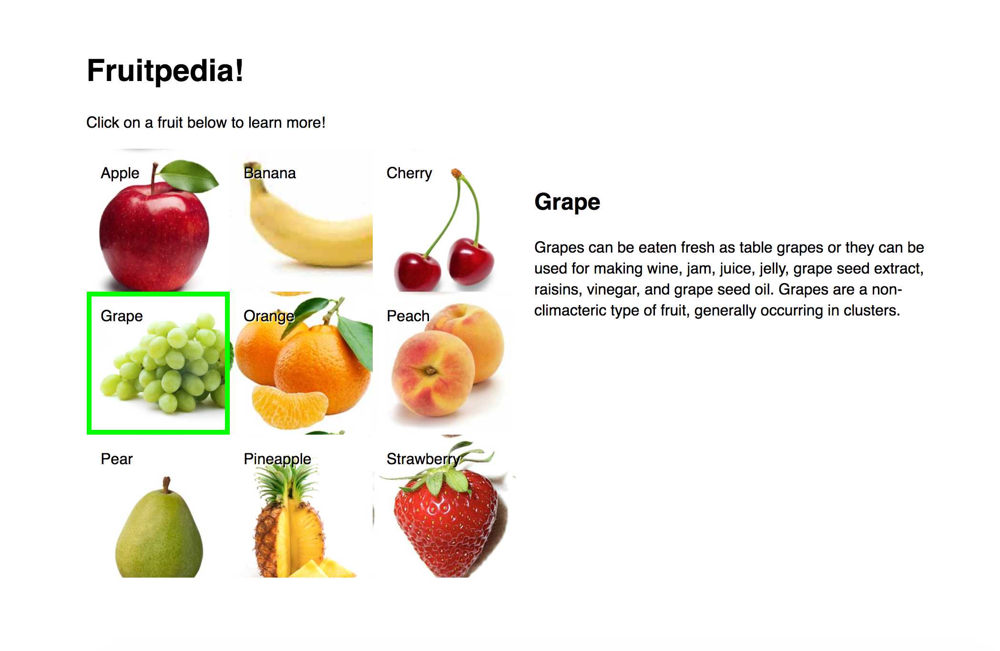

# FEWD Assignment #7: Using `this` with jQuery

---


### Description

Wikipedia has spun off a new website dedicated to fruit called Fruitpedia!
The website is designed to teach users fruit facts. The design team for
Fruitpedia has been hard at work and has handed off to you all the CSS and
HTML you'll need to complete the assignment. The only thing that's left for you to do is bring the site to life with JavaScript and jQuery!

When the user clicks a fruit, the following should happen:
1. The selected fruit menu option should become "active" by adding the `active` CSS class to the element.
2. Only one fruit should have the `active` class at a time. So you'll need to do some cleanup work to make sure only the fruit the user last clicked on
has the active styles.
3. The title of the fruit (e.g. Apple, Banana, etc.) should be placed inside the element with the id of `title`.
4. The description of the fruit should be placed inside the paragraph with an id of `description`.

The Fruitpedia design team has saved you the hassle of looking up the fruit fact descriptions. You'll find them inside a comment block inside `js/main.js`. Be careful though, the designers noted that there may be some existing single and double quotes in the strings so you'll need to figure out how to work around that.

<br>

---


### Technical Requirements

- Use the keyword ```this``` inside your event handler(s)
- Handle strings that contain quotation marks (single ```'``` or double ```"```) appropriately
- Use ```$.html()```, ```$.addClass()``` and ```$.removeClass()```
- Use the ```$.click()``` event

<br>

#### Bonus

- Move any duplicate code into a reusable JavaScript function or functions. Call/invoke the function by name (e.g. ```myFunction()```);




<br>

---

### Resources


- [jQuery $(this) Selector with Examples](http://html-tuts.com/jquery-this-selector/)
- [Escaping quotes in JavaScript](https://ga-students.github.io/fewd-dc-31/09_variables_conditionals/#/13/1)

Read ahead [about responsive design for next week](http://www.smashingmagazine.com/2011/01/12/guidelines-for-responsive-web-design/)


<br>

---

### Evaluation / Submission


When ready for evaluation they should push their code to that repository. Instructional team should evaluate against the solution code and the student's use of technical elements. They will provide a numeric grade on a scale: does not meet expectations (0); meets expectations (1); exceeds expectations (2).  The maximum possible score on this assignment is 12/12. Bonus materials are completely optional.
